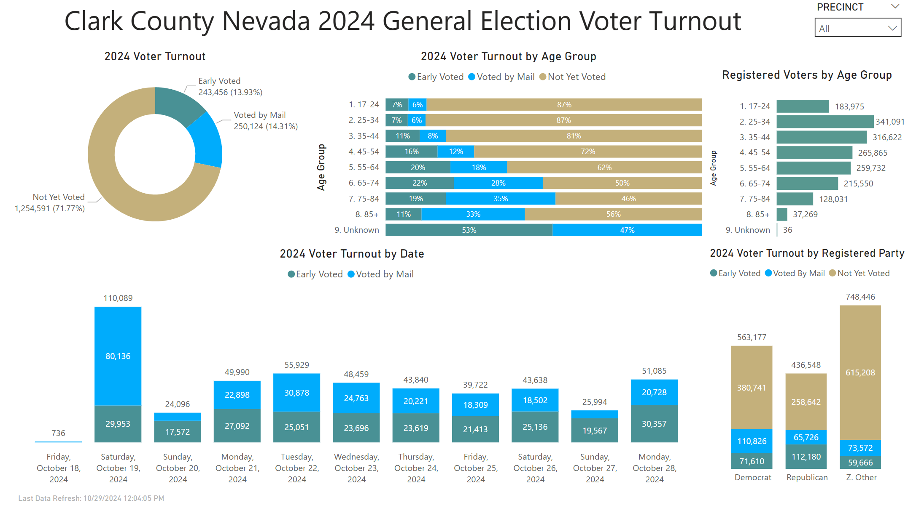

# Clark County 2024 General Election

 Store and visualize voter turnout data from Clark County, NV

## Files Used

 Publically available data from Clark County, NV elections website:

 Master Voter List: <https://www.clarkcountynv.gov/government/departments/elections/reports_data_maps/voter_list_data_files.php>

 Mail-in Ballot Data: <https://www.clarkcountynv.gov/government/departments/elections/reports_data_maps/mb-data.php>

 Early Voting Data: <https://www.clarkcountynv.gov/government/departments/elections/reports_data_maps/early_voting_turnout_data.php>

## Code

[TSQL Code](/Scripts/) - Loaded the flat files into Microsoft SQL using T-SQL BULK INSERT statements.  Cleaned up the data a little to remove duplicate entries.

## Visualizations

[Power BI Report](Clark_County_NV_General_Election_2024.pbix) - Created a quick dashboard in Microsoft Power BI to visualize who has already voted and how.

## Screenshots

### Snapshot from 10/29/2024

### Snapshot from 10/30/2024

### Snapshot from 10/31/2024

### Snapshot from 11/01/2024

